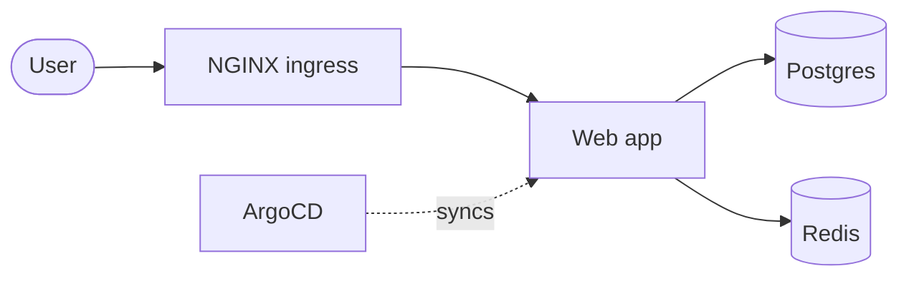
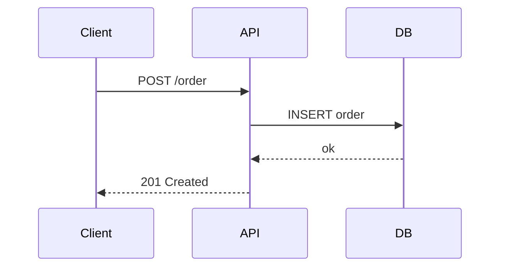
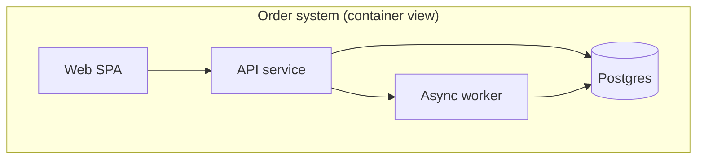
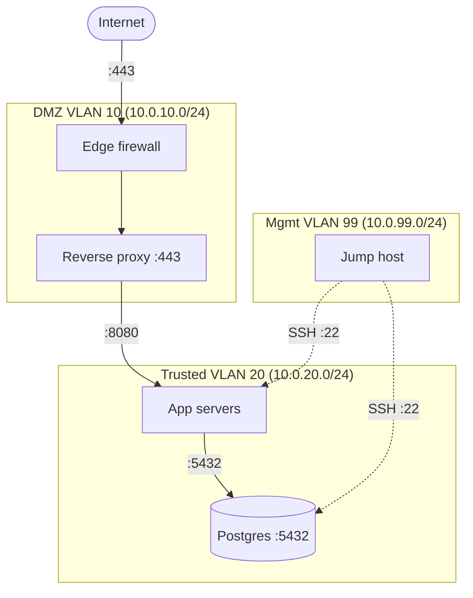

# Docs + diagrams

Runbook for clear technical writing and diagrams that live in git as text.
Default to **plain, skimmable prose and versioned diagrams-as-code** over prose
walls and binary image blobs.

## When to use which

- **This skill** — general runbooks, architecture docs, ADRs, network/infra
  diagrams, READMEs.
- **A formal in-house template skill** (if one is installed) — for a required
  corporate document format (fixed template, colors, NFR/glossary structure).
  If the ask names that template, use that dedicated skill, not this one.

## Writing principles

- **Lead with the answer.** First sentence states what this doc lets the reader
  do. No throat-clearing.
- **Write for the tired on-call engineer at 3am.** Imperative steps, exact
  commands, expected output. "Run X; you should see Y; if not, Z."
- **Show state changes explicitly.** Call out anything destructive or
  irreversible before the step, not after.
- **One idea per paragraph. One task per numbered step.** Prefer tables for
  option/flag matrices and short bulleted lists over dense paragraphs.

### Runbook skeleton

```markdown
# <Service> — <Operation> runbook

**When to use:** symptom or trigger.
**Impact / blast radius:** what this touches.
**Prerequisites:** access, tools, context.

## Steps
1. <command> — expected: <output>
2. ...

## Verification
How to confirm success.

## Rollback
How to undo, and the point of no return.

## Escalation
Who/what if this fails.
```

### ADR (Architecture Decision Record)

One decision per file, `docs/adr/NNNN-short-title.md`, immutable once accepted
(supersede with a new ADR rather than editing):

```markdown
# ADR-0007: Use sealed-secrets for in-cluster secret storage

- Status: Accepted (2026-07-05)
- Context: Manifests live in git; we need secrets at rest safely.
- Decision: Adopt Bitnami sealed-secrets, controller per cluster.
- Consequences: + git-safe secrets; - controller key is now critical to back up.
- Alternatives considered: sops+age (rejected: prefers CR-native flow).
```

## Diagrams as code — Mermaid

Keep diagrams as **text in the repo** so they diff, review, and version like
code. Embed in Markdown fenced blocks (```` ```mermaid ````). Render via the
Mermaid Chart MCP (`validate_and_render_mermaid_diagram`) to check syntax
before committing. **Lucid MCP is available** for richer, hand-tunable, or
audience-facing diagrams (org charts, ERDs, polished network canvases) — reach
for it when Mermaid's layout is too limiting, but keep an in-repo Mermaid source
of truth where you can.

### Flowchart / architecture



### Sequence



### C4-ish container view



## Network / infra diagrams

For network topology, make the **trust boundaries and data flows** the primary
information, not just box connectivity:

- **Nodes**: label with role + address/CIDR (`edge-fw 203.0.113.1`,
  `k8s-node 10.42.0.0/24`).
- **VLANs / subnets**: group with `subgraph` per VLAN or zone; put the CIDR in
  the subgraph title.
- **Trust zones**: use subgraphs for DMZ / trusted / management, and make
  cross-zone edges explicit — every arrow crossing a boundary is a firewall rule
  worth naming.
- **Data flows**: label edges with protocol/port and direction (`:443`,
  `:6443`, `WireGuard :51820`). Dashed for control-plane / management, solid for
  data-plane.



Keep the Mermaid source next to the doc it illustrates (`docs/net-topology.md`)
so the diagram and its explanation review together and never drift.
