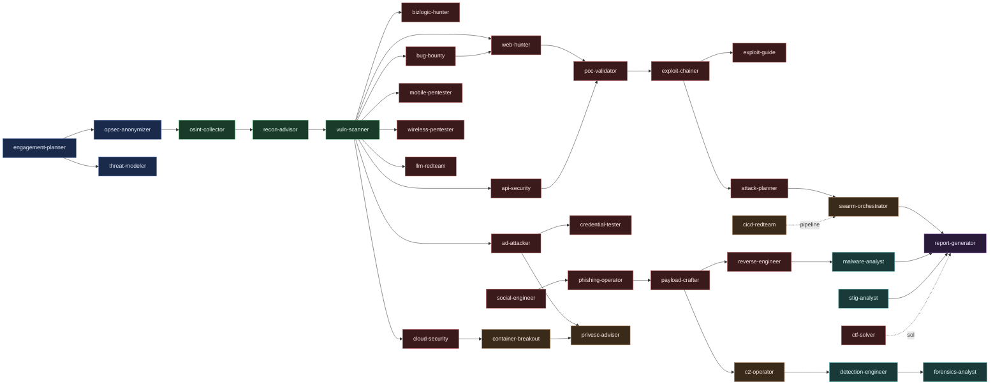

<div align="center">

# pentest-ai-agents

**50 Claude Code subagents for penetration testing.**

[](LICENSE)
[](https://docs.anthropic.com/en/docs/claude-code)
[]()
[]()
[](https://github.com/0xSteph/pentest-ai-agents/stargazers)

[Quick Start](#quick-start) | [Cheatsheet](#cheatsheet) | [Coverage](#coverage) | [Agents](#agents) | [Examples](#examples)

</div>

---

## Table of Contents

- [What's New in v3.3](#whats-new-in-v33)
- [What's New in v3.2](#whats-new-in-v32)
- [Agent Map](#agent-map)
- [What's New in v3.1](#whats-new-in-v31)
- [Quick Start](#quick-start)
- [Cheatsheet](#cheatsheet)
- [Coverage](#coverage)
- [Agents](#agents)
- [Tier 1 vs Tier 2](#tier-1-vs-tier-2)
- [Examples](#examples)
- [Running Tools in a Container](#running-tools-in-a-container)
- [Findings Database](#findings-database)
- [Token Optimization](#token-optimization)
- [Local Models](#local-models)
- [Documentation](#documentation)
- [MCP Server](#mcp-server)
- [Prerequisites](#prerequisites)
- [Legal](#legal)
- [License](#license)

---

pentest-ai-agents is a collection of 50 Claude Code subagents that turn Claude into an offensive security research assistant. Each agent carries deep domain knowledge in a specific area: recon, web, Active Directory, cloud, mobile, wireless, social engineering, payload crafting, reverse engineering, exploit chaining, detection engineering, forensics, and more.

Install the agent files. Open Claude Code. Describe your task. Claude routes to the right specialist automatically.

No servers, no Python deps, no setup beyond copying files.

## What's New in v3.3

- **Installable as a Claude Code plugin.** Two lines — `/plugin marketplace add 0xSteph/pentest-ai-agents` then `/plugin install pentest-ai-agents@pentest-ai-agents`. The `install.sh` curl path still works unchanged.
- **15 new agents (35 → 50):** `ai-recon` (AI attack-surface mapping), `code-auditor`, `crypto-analyzer`, `password-auditor`, `database-attacker`, `network-attacker`, `traffic-analyzer`, `compliance-mapper`, `risk-scorer`, plus the post-exploitation set — `evasion-specialist`, `persistence-planner`, `data-exfiltrator`, `scada-attacker`, `iot-pentester`, `lateral-movement`. Every offensive agent pairs its techniques with the detection they exercise.
- **Hardened CI validator.** A SHA-pinned, least-privilege workflow validates each agent's frontmatter, requires the scope-guard block on every Bash-capable (Tier 2) agent, checks the plugin manifests, and smoke-tests the installer.
- **Scope-guard gap closed.** `cicd-redteam` is Bash-capable but was missing the mandatory scope-enforcement block — now fixed (the new CI check would have caught it).
- **Installer fixes.** `curl | bash` no longer crashes under `set -u`, the one-liner clone URL is corrected, slash commands now install alongside the agents, and `--uninstall` removes everything cleanly.
- **Minimal offline Docker bundle** with a digest-pinned base and non-root user — packaging only, no tooling baked in.

## What's New in v3.2

- **4 new agents**: `c2-operator` (Sliver/Mythic/Havoc/Cobalt Strike profile tuning, beacon hygiene, redirector design), `container-breakout` (Docker/K8s escape, runc/cri-o CVEs, kubelet exploitation, RBAC abuse), `opsec-anonymizer` (operator-side identity hygiene, source IP design, burner infrastructure, fingerprint hygiene), `llm-redteam` (OWASP LLM Top 10 testing, prompt injection, RAG poisoning, MCP server abuse, agent tool abuse).
- **Tightened scope guard**: explicit hard-refusal list in `_scope-guard.md` covers DoS, mass scanning, unattended worms, false-flag operations, safety-of-life systems.
- **Findings DB v2**: `vulns.tool_used` column for filtering findings by the tool that produced them; new indexes on `cve` and `tool_used`. Existing engagements migrate forward via `db/migrate.sh`.
- **Agent map diagram**: visual flow from recon to closure mapped to agent names ([see below](#agent-map)).

## Agent Map



Tier 1 (advisory) agents are routable from any task. Tier 2 (execution-capable) agents require a declared scope and live in the offensive operations cluster.

## What's New in v3.1

- **3 new agents**: `payload-crafter` (msfvenom, Donut, custom loaders), `reverse-engineer` (Ghidra, JadX, Radare2, Binwalk), `phishing-operator` (Evilginx, GoPhish, dnstwist)
- **Slash commands**: `/recommend "freeform task"` routes you to the right agent + concrete commands. `/agents-for <tag>` filters the catalog by domain.
- **`db/doctor.sh`**: audits which underlying CLI tools are installed on your box, grouped by agent. Shows `✔` and `✘` per tool with install hints.
- **`install.sh --tools`**: opt-in installer that pulls in the underlying tools via apt/brew/pacman + pipx/go/cargo.
- **Extended agents**: Commix added to web-hunter, RouterSploit added to vuln-scanner, targeted wordlist generation (cupp, CeWL, Mentalist, Crunch, hashid, haiti) added to credential-tester, full steganography toolkit added to ctf-solver.

## Quick Start

One command:

```bash
curl -fsSL https://raw.githubusercontent.com/0xSteph/pentest-ai-agents/main/install.sh | bash
```

That's it. The script clones the repo to a temp dir, copies the agents to `~/.claude/agents/`, and exits. Idempotent: safe to re-run for updates.

**Or install as a Claude Code plugin** (no clone; updates through the marketplace):

```
/plugin marketplace add 0xSteph/pentest-ai-agents
/plugin install pentest-ai-agents@pentest-ai-agents
```

This registers all 50 agents and the slash commands through Claude Code's plugin system. Pick the plugin **or** the installer — you don't need both.

Then open Claude Code:

```
"Plan an internal network pentest for a 500-endpoint AD environment with a 2-week window."
```

Claude routes to the engagement planner agent and produces a phased plan with MITRE ATT&CK mappings.

**Prefer to clone first?**

```bash
git clone https://github.com/0xSteph/pentest-ai-agents.git
cd pentest-ai-agents && ./install.sh --global
```

**Other install options:**

```bash
./install.sh --project     # Install for current project only
./install.sh --global --lite  # Use Haiku for advisory agents (lower cost)
./install.sh --tools       # Install underlying CLI tools (nmap, nuclei, ffuf, etc.)
./install.sh --help        # All options
```

See [INSTALL.md](INSTALL.md) for step-by-step instructions, including first-time Claude Code setup.

---

## Cheatsheet

Quick interactions once installed:

| Command | What It Does |
|---------|--------------|
| `/recommend "phish a small SaaS team's IT department"` | Picks the right agent and gives concrete next commands |
| `/agents-for web` | Lists every agent relevant to web testing (web-hunter, api-security, bug-bounty, bizlogic-hunter) |
| `/agents-for cloud` | Cloud-specific agents (cloud-security, cicd-redteam) |
| `db/doctor.sh` | Audits which underlying CLI tools you have, grouped by agent. Shows `✔/✘` and install hints. |
| `db/doctor.sh --agent ad-attacker` | Audit just the AD tooling stack |
| `db/doctor.sh --json` | Machine-readable output for piping into a script |
| `install.sh --tools` | Install the underlying tools via your package manager + pipx/go/cargo |
| `findings.sh init <id>` | Start a new engagement (persistent SQLite findings DB) |
| `findings.sh stats` | Engagement progress |
| `findings.sh export` | Full JSON export |
| `bash handoff.sh` | Markdown handoff report between sessions |

In Claude Code, just describing your task routes automatically:

```
"Plan an internal pentest for a 500-endpoint AD environment, 2-week window."
"I have a domain user, where do I look first in BloodHound?"
"Convert this SharpHound EXE into shellcode for an EDR test, with detection content."
"Reverse this firmware image and tell me what the cryptographic protocol looks like."
"Run a phishing simulation against acme-corp.com, set up GoPhish + Evilginx infrastructure."
```

---

## Coverage

What the agents drive. Categories map to the same surface real adversaries operate across:

| Category | Agents | Underlying Tools (installable via `install.sh --tools`) |
|----------|--------|--------------------------------------------------------|
| **Recon and OSINT** | recon-advisor, osint-collector | nmap, masscan, rustscan, dig, whois, subfinder, amass, httpx, theHarvester, sherlock, holehe, maigret |
| **Vulnerability scanning** | vuln-scanner | nuclei, nikto, RouterSploit, nmap NSE, OpenVAS/Nessus parsing |
| **Web app testing** | web-hunter, api-security, bug-bounty, bizlogic-hunter | ffuf, gobuster, feroxbuster, sqlmap, dalfox, Commix, dirsearch, whatweb |
| **Active Directory** | ad-attacker, credential-tester | BloodHound, Impacket, NetExec/CrackMapExec, Certipy, kerbrute, Responder, ldapsearch |
| **Credentials and cracking** | credential-tester, password-auditor | Hydra, Hashcat, John, Medusa, cupp, CeWL, NIST 800-63B policy audit, HIBP k-anonymity |
| **Cloud** | cloud-security, cicd-redteam | aws/az/gcloud CLIs, Trivy, Prowler, ScoutSuite, Pacu |
| **Containers and K8s breakout** | container-breakout | kubectl, kube-hunter, peirates, CDK, Falco rule pairing |
| **C2 operations** | c2-operator | Sliver, Mythic, Havoc, Cobalt Strike, malleable profiles, redirector design |
| **AI / LLM red teaming** | ai-recon, llm-redteam | A2A/MCP/RAG surface discovery, model fingerprinting, Garak, PyRIT, Promptfoo, OWASP LLM Top 10, MITRE ATLAS |
| **Operator opsec** | opsec-anonymizer | source IP design, burner identity, JA3/fingerprint hygiene, burn checklists |
| **Mobile** | mobile-pentester, reverse-engineer | Frida, Objection, jadx, apktool, MobSF, adb |
| **Wireless** | wireless-pentester | aircrack-ng, hcxdumptool, hcxtools, bettercap, wifite |
| **Social engineering** | social-engineer, phishing-operator | GoPhish, Evilginx, dnstwist, Modlishka |
| **Payload crafting** | payload-crafter | msfvenom, Donut, MSFvenom Payload Creator, custom loader patterns |
| **Reverse engineering** | reverse-engineer, malware-analyst | Ghidra, Radare2, JadX, Binwalk, Apktool, IDA, dnSpy, Volatility 3 |
| **Forensics and IR** | forensics-analyst, malware-analyst | Volatility 3, exiftool, foremost, YARA, Wireshark/tshark, Autopsy |
| **Exploit chaining** | exploit-chainer, attack-planner, poc-validator | Multi-step attack composition, ATT&CK-mapped chain scoring |
| **Database attacks** | database-attacker | sqlmap, NoSQLMap, native clients (MySQL/PostgreSQL/MSSQL/Oracle/MongoDB/Redis) |
| **Network L2/L3 and traffic** | network-attacker, traffic-analyzer | Responder, ntlmrelayx, mitm6, bettercap, Wireshark/tshark, Zeek |
| **Post-exploitation** | lateral-movement, persistence-planner, evasion-specialist, data-exfiltrator | PtH/PtT, WMI/WinRM/DCOM, AMSI/ETW evasion, DNS/HTTPS exfil, golden ticket |
| **ICS / OT** | scada-attacker | Modbus, DNP3, S7comm, EtherNet/IP, OPC-UA, OT-aware IDS pairing |
| **IoT / embedded** | iot-pentester | binwalk, UART/JTAG/SPI, BLE/Zigbee/sub-GHz, firmware analysis |
| **Secure code and crypto** | code-auditor, crypto-analyzer | Semgrep, CodeQL, gitleaks, testssl.sh, jwt_tool |
| **Detection and defense** | detection-engineer, threat-modeler, stig-analyst | Sigma, Splunk SPL, Elastic KQL, Sentinel KQL, STRIDE/DREAD, DISA STIG |
| **CTF** | ctf-solver | zsteg, steghide, stegseek, pngcheck, plus generic toolchain |
| **Reporting, risk and compliance** | engagement-planner, report-generator, risk-scorer, compliance-mapper | MITRE ATT&CK mapping, CVSS 3.1/4.0, EPSS, CISA KEV, PCI/NIST/ISO/CIS mapping |

Run `bash db/doctor.sh` to see which of these are present on your box right now and what's missing.

---

## Agents

### Offensive Operations

| Agent | What It Does |
|-------|-------------|
| **Engagement Planner** | Phased pentest plans with MITRE ATT&CK mappings, time estimates, and ROE templates |
| **Recon Advisor** | Parses Nmap/Nessus/BloodHound output, prioritizes targets, recommends next commands. *Tier 2: executes recon tools directly.* |
| **OSINT Collector** | Domain recon, email harvesting, social media profiling, breach data analysis |
| **Exploit Guide** | Attack methodology for AD, web, cloud, and post-exploitation with defensive perspective |
| **Privilege Escalation** | Linux and Windows privesc: SUID, tokens, services, kernel exploits, container escape |
| **Cloud Security** | AWS/Azure/GCP pentesting: IAM escalation, container escape, serverless exploitation |
| **API Security** | REST, GraphQL, WebSocket testing. OWASP API Top 10, JWT attacks, OAuth exploitation |
| **Mobile Pentester** | Android/iOS analysis with Frida, Objection, jadx. OWASP MASTG/MASVS mapping |
| **Wireless Pentester** | WPA/WPA2/WPA3, evil twin, rogue AP, enterprise 802.1X, Bluetooth security |
| **Social Engineer** | Phishing campaigns, pretexting, vishing for authorized red team engagements |
| **Vuln Scanner** | Nuclei, Nikto, Nmap NSE scans. Parses Nessus/OpenVAS results. *Tier 2: executes scans.* |
| **Web Hunter** | ffuf, gobuster, sqlmap, dalfox. Content discovery, fuzzing, WAF detection. *Tier 2: executes web tools.* |
| **Credential Tester** | Hydra, Hashcat, John, CrackMapExec. Hash identification, wordlist generation |
| **Attack Planner** | Correlates findings into multi-step attack chains. Scores by probability, stealth, and impact |
| **Bug Bounty Hunter** | HackerOne/Bugcrowd methodology, duplicate avoidance, report writing for maximum payout |
| **AD Attacker** | BloodHound, Impacket, CrackMapExec, Certipy. Kerberos, delegation, ACL, and cert abuse. *Tier 2: executes AD tools.* |
| **Exploit Chainer** | Chains low-severity findings into full compromise paths. Step-by-step with approval gates. *Tier 2.* |
| **PoC Validator** | Generates and safely executes proof of concept scripts. Eliminates false positives. *Tier 2.* |
| **Payload Crafter** | msfvenom, Donut, custom loaders. Pairs every payload with YARA/Sigma detection content. |
| **Reverse Engineer** | Ghidra, JadX, Radare2, Binwalk. Static analysis of firmware, mobile apps, and binaries. |
| **Phishing Operator** | Evilginx, GoPhish, dnstwist infrastructure. Live campaign tooling for authorized red team. |
| **Swarm Orchestrator** | Coordinates all agents as a red team swarm. Parallel workstreams, progress tracking. |
| **Business Logic Hunter** | Price manipulation, workflow bypass, race conditions, authorization flaws. *Tier 2.* |
| **CI/CD Red Team** | GitHub Actions, GitLab CI, Jenkins pipeline configs with security gates |
| **C2 Operator** | Sliver, Mythic, Havoc, Cobalt Strike. Listener tuning, beacon hygiene, redirector design, engagement burn |
| **Container Breakout** | Docker/K8s escape, runc/cri-o CVEs, kubelet exploitation, RBAC abuse, admission controller bypass |
| **OpSec Anonymizer** | Operator-side identity hygiene, source IP strategy, burner infrastructure, browser/JA3 fingerprint hygiene |
| **LLM Red Team** | OWASP LLM Top 10 testing, prompt injection, RAG poisoning, agent tool abuse, MCP server exploitation |
| **AI Recon** | Maps the AI attack surface: AI/LLM endpoints, A2A agent cards, MCP exposure, RAG/tool surface, model fingerprint. *Tier 2: executes read-only recon.* |
| **Password Auditor** | NIST 800-63B policy + hash-storage audit, breach exposure (HIBP k-anonymity), lockout-safe spray planning |
| **Database Attacker** | SQL/NoSQL injection depth, DB privilege escalation, proof-scoped extraction across major engines. *Tier 2.* |
| **Network Attacker** | LLMNR/NBT-NS poisoning, NTLM relay, mitm6, ARP MITM, pivoting. *Tier 2: executes L2/L3 attacks.* |
| **Evasion Specialist** | AV/EDR evasion, AMSI/ETW bypass, in-memory execution — every technique paired with its detection |
| **Persistence Planner** | Host/AD/cloud persistence (golden ticket, WMI, services) with mandatory cleanup tracking + detection |
| **Data Exfiltrator** | DNS/HTTPS/ICMP exfil and DLP/egress testing with synthetic/canary data — paired with detection |
| **SCADA Attacker** | ICS/OT protocol analysis (Modbus/DNP3/S7comm/OPC-UA), safety-gated, passive-first |
| **IoT Pentester** | Firmware, hardware interfaces (UART/JTAG), radio (BLE/sub-GHz), and device-cloud testing |
| **Lateral Movement** | PtH/PtT, WMI/WinRM/DCOM/SSH, token theft, pivot planning — paired with detection |

### Defense and Analysis

| Agent | What It Does |
|-------|-------------|
| **Detection Engineer** | Sigma, Splunk SPL, Elastic KQL, Sentinel KQL rules with false positive tuning |
| **Threat Modeler** | STRIDE/DREAD analysis, attack trees, data flow diagrams |
| **Forensics Analyst** | Evidence acquisition, memory forensics, disk analysis, timeline construction |
| **Malware Analyst** | Static/dynamic analysis, reverse engineering, YARA rules, IOC extraction |
| **STIG Analyst** | DISA STIG compliance, GPO remediation paths, keep-open justification templates |
| **Code Auditor** | Secure-code review: injection, authz, secrets, deserialization (Semgrep, CodeQL, gitleaks) |
| **Crypto Analyzer** | Weak algorithms/modes, key and IV/nonce handling, TLS/cert config, JWT/JWE token issues |
| **Traffic Analyzer** | Offline pcap analysis: protocol dissection, credential extraction, beacon/anomaly hunting |

### Reporting and Learning

| Agent | What It Does |
|-------|-------------|
| **Report Generator** | Professional pentest reports with executive summaries, CVSS scoring, remediation roadmaps |
| **CTF Solver** | HackTheBox, TryHackMe, PicoCTF. Web, pwn, rev, crypto, forensics, OSINT |
| **Compliance Mapper** | Maps findings to PCI DSS, NIST 800-53/CSF, ISO 27001, CIS, HIPAA, SOC 2 with control-gap analysis |
| **Risk Scorer** | CVSS 3.1/4.0 vectors, EPSS + CISA KEV enrichment, business-context remediation prioritization |

---

## Tier 1 vs Tier 2

**Tier 1 (all agents):** Advisory mode. You paste tool output, ask methodology questions, get analysis and recommendations. You run the tools yourself.

**Tier 2 (select agents):** Can also compose and execute commands directly. You declare your authorized scope, the agent validates every target against it, and Claude Code shows you each command for approval before it runs.

| Tier 2 Agent | What It Executes |
|-------|-----------------|
| **Recon Advisor** | nmap, dig, whois, curl, netcat, traceroute, whatweb, nikto |
| **Vuln Scanner** | nuclei, nikto, nmap NSE scripts |
| **Web Hunter** | ffuf, gobuster, feroxbuster, sqlmap, dalfox, whatweb |
| **AD Attacker** | BloodHound, Impacket, CrackMapExec, Certipy, ldapsearch, enum4linux |
| **Exploit Chainer** | Multi-step chain execution with approval at each gate |
| **PoC Validator** | Safe, non-destructive proof of concept scripts |
| **Business Logic Hunter** | Logic flaw tests (price manipulation, race conditions) |
| **AI Recon** | AI endpoint discovery, /v1/models probes, A2A/MCP enumeration (read-only) |
| **Database Attacker** | sqlmap, NoSQLMap, native DB clients (proof-scoped, non-destructive) |
| **Network Attacker** | Responder, ntlmrelayx, mitm6, bettercap (scoped L2/L3 positioning) |
| **CI/CD Red Team** | Pipeline-driven SAST/DAST/secret scans against in-scope targets |

See [docs/TIER2-EXECUTION.md](docs/TIER2-EXECUTION.md) for the full safety model.

---

## Examples

```
$ claude

You: Analyze this Nmap scan and prioritize targets for our internal pentest

> Routing to recon-advisor agent...

## Prioritized Target Summary

### Critical Priority
| Host       | Port | Service | Finding                  |
|------------|------|---------|--------------------------|
| 10.10.1.5  | 445  | SMB     | SMBv1 enabled, MS17-010  |
| 10.10.1.20 | 3389 | RDP     | BlueKeep (CVE-2019-0708) |

### Recommended Next Steps
1. nmap -sV --script smb-vuln* 10.10.1.5
2. crackmapexec smb 10.10.1.0/24
3. bloodhound-python -d corp.local
```

More examples in the [examples/](examples/) directory:

| Example | Agent | What It Shows |
|---------|-------|---------------|
| [Engagement Plan](examples/example-engagement-plan.md) | engagement-planner | Full phased plan with MITRE ATT&CK mappings |
| [Nmap Analysis](examples/example-nmap-analysis.md) | recon-advisor | Prioritized attack vectors with follow-up commands |
| [Detection Rule](examples/example-detection-rule.md) | detection-engineer | Kerberoasting detection in Sigma, SPL, and KQL |
| [STIG Finding](examples/example-stig-finding.md) | stig-analyst | STIG analysis with GPO path and keep-open template |
| [Report Excerpt](examples/example-report-excerpt.md) | report-generator | SQL injection finding formatted for a pentest report |

---

## Running Tools in a Container

Run your security tools inside a Docker container to keep your workstation clean and avoid endpoint protection flags.

```bash
docker pull kalilinux/kali-rolling
docker run -it --name pentest-lab kalilinux/kali-rolling /bin/bash
apt update && apt install -y nmap nikto sqlmap metasploit-framework bloodhound
```

Use pentest-ai agents on your host for methodology and analysis. Run the actual tools inside the container.

---

## Findings Database

Persistent SQLite storage that keeps engagement data across Claude Code sessions.

```bash
findings.sh init acme-2024 --client "ACME Corp" --type internal --scope "10.0.0.0/24"
export PENTEST_AI_ENGAGEMENT="acme-2024"

findings.sh stats         # Check progress
findings.sh list vulns    # See all findings
findings.sh export        # Full JSON export
bash handoff.sh           # Markdown handoff report for next session
```

Tier 2 agents write to the database automatically when `findings.sh` is in PATH. See [docs/FINDINGS-DB.md](docs/FINDINGS-DB.md) for full docs.

---

## Token Optimization

Install with lite mode to run advisory agents on Haiku (lower cost, same methodology):

```bash
./install.sh --global --lite
```

See [docs/TOKEN-OPTIMIZATION.md](docs/TOKEN-OPTIMIZATION.md) for the full guide.

---

## Local Models

The agents are plain markdown system prompts — the only Claude-specific part is the YAML frontmatter header. They run on any model: point Claude Code at any Anthropic-compatible endpoint by setting `ANTHROPIC_BASE_URL`, or copy the system prompt (everything below the frontmatter) into any local runner such as Ollama or LM Studio.

See [docs/LOCAL-SETUP.md](docs/LOCAL-SETUP.md) for local-model notes.

---

## Documentation

| Document | Description |
|----------|-------------|
| [INSTALL.md](INSTALL.md) | Installation guide with troubleshooting |
| [Agent Guide](docs/AGENT-GUIDE.md) | How each agent works and when to use it |
| [Tier 2 Execution](docs/TIER2-EXECUTION.md) | Execution mode safety model and conversion guide |
| [Local Setup](docs/LOCAL-SETUP.md) | Run offline with Ollama and local GPU |
| [Customization](docs/CUSTOMIZATION.md) | Modify agents, change models, create new agents |
| [Token Optimization](docs/TOKEN-OPTIMIZATION.md) | Reduce token consumption |
| [Findings Database](docs/FINDINGS-DB.md) | Persistent SQLite storage for engagement data |
| [Data Privacy](docs/DATA-PRIVACY.md) | LLM data handling and local model options |
| [Changelog](CHANGELOG.md) | Version history |

---

## MCP Server

Looking for the automated pipeline? **[pentest-ai](https://github.com/0xSteph/pentest-ai)** is the companion MCP server with 150+ tool wrappers, autonomous exploit chaining, and CI/CD integration. Works with Claude Desktop, Cursor, VS Code Copilot, and any MCP client.

---

## Prerequisites

- [Claude Code](https://docs.anthropic.com/en/docs/claude-code) installed and configured
- Claude Pro or Max subscription
- For security testing: signed rules of engagement and defined scope

---

## Legal

This toolkit is for **authorized security testing only**. Users must have proper written authorization before using these agents in any engagement. See [DISCLAIMER.md](DISCLAIMER.md) for full terms.

---

## License

[MIT License](LICENSE)

---

<div align="center">

Built by [0xSteph](https://github.com/0xSteph) &middot; [pentestai.xyz](https://pentestai.xyz)

</div>
